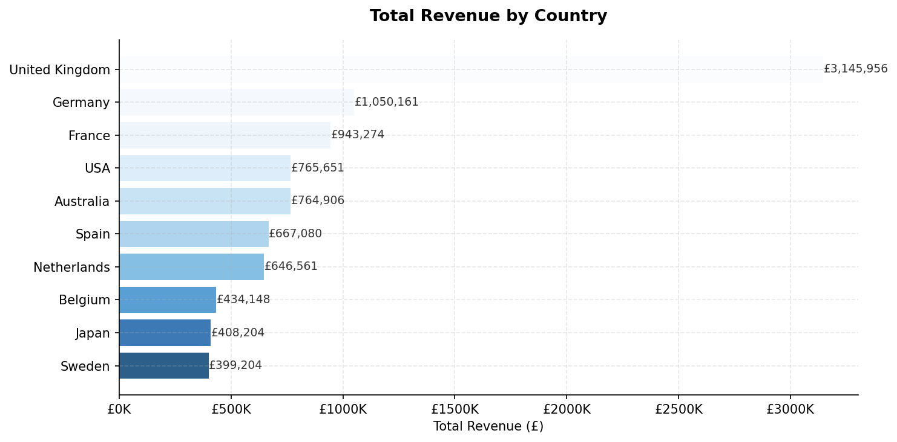
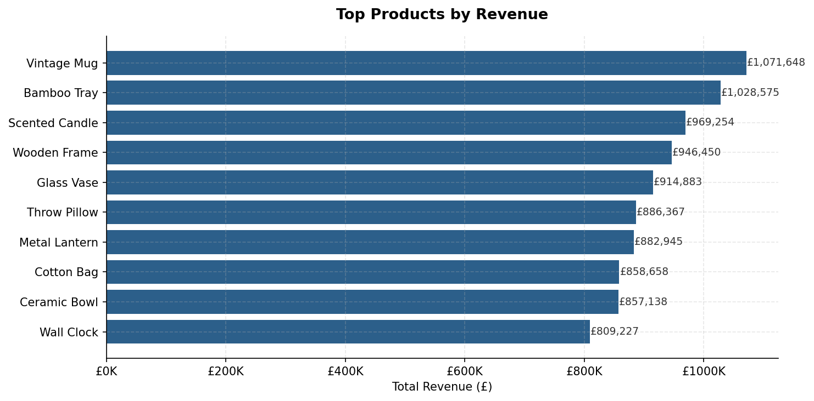
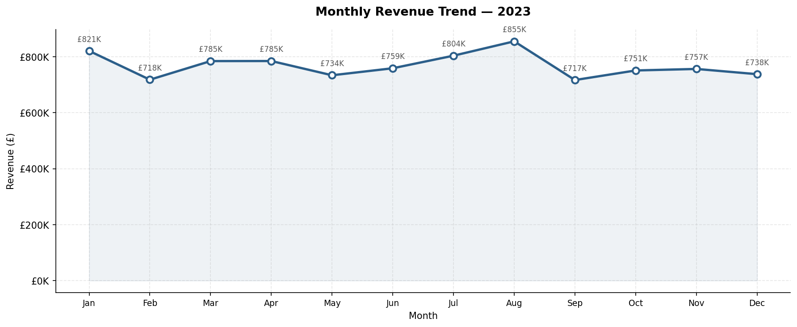
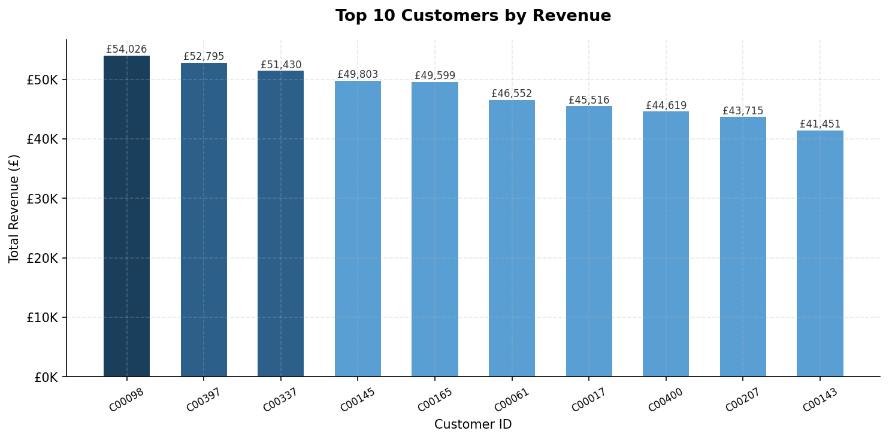

# E-Commerce Sales Analysis

## Overview
Analysis of 5,000 e-commerce transactions across 10 countries for 2023.

## Tools Used
- Python (Pandas, Matplotlib)
- SQL (MySQL)
- Tableau

## Business Questions Answered
1. Which country generates the most revenue?
2. What are the top selling products?
3. What is the monthly revenue trend?
4. Who are the top 10 customers?
5. What is the average order value?

## Key Findings
- UK is the top market generating £3.1M (34% of total revenue)
- Vintage Mug is the best selling product at £1.07M
- August recorded highest monthly revenue at £855K
- Top 10 customers contribute 5.2% of total revenue
- Average order value is £1,913

## Files
- `ecommerce_analysis.py` — Python analysis code
- `queries.sql` — SQL queries
- `charts/` — All visualisations

## Charts

